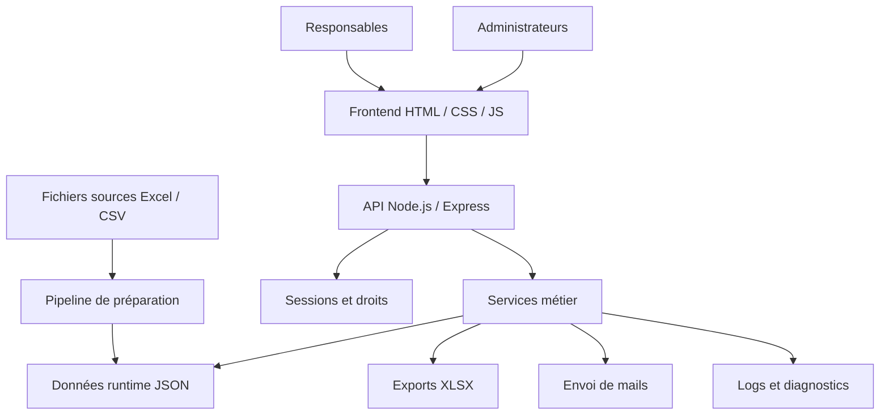
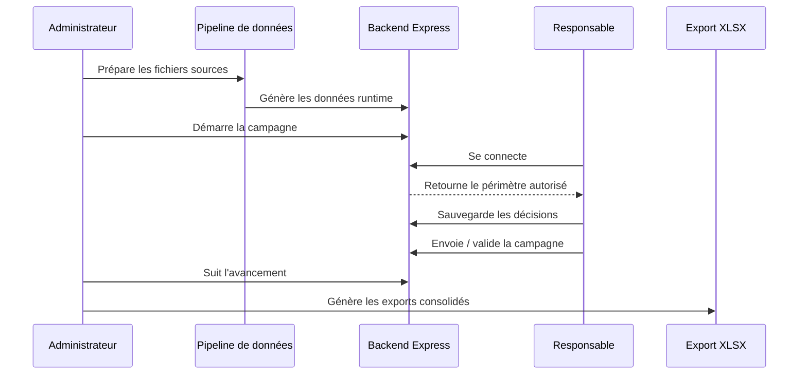

# Cap RH+ — Étude de cas publique et anonymisée

> Projet professionnel réalisé à l’ARS Normandie.  
> Cette page présente l’architecture, les objectifs et les apports du projet sans publier de données confidentielles.

## Résumé

**Cap RH+** est une application métier RH développée pour piloter une campagne interne de valorisation au sein d’un environnement public / santé. Le projet a été réalisé de bout en bout : compréhension du besoin, conception fonctionnelle, développement frontend et backend, préparation des données, sécurisation des accès, exports, mails, tests, documentation et accompagnement utilisateur.

Le logiciel permet à des responsables de consulter leur périmètre hiérarchique, de renseigner ou vérifier des éléments de campagne, de commenter leurs choix, de sauvegarder leur avancement, puis de transmettre leurs décisions selon une logique de validation. Les administrateurs peuvent préparer la campagne, suivre son avancement, gérer certains paramètres, envoyer des mails et produire des exports.

Le projet n’est pas publié sous forme de code complet car il manipule des données RH et des paramètres internes. Cette page est donc une **étude de cas anonymisée** destinée à présenter les choix techniques, le périmètre fonctionnel et les compétences mobilisées.

---

## Pourquoi ce projet compte dans mon parcours

Cap RH+ est mon premier vrai gros projet d’entreprise réalisé **100 % end-to-end**. Il ne s’agit pas seulement d’un développement technique : le projet inclut la compréhension d’un processus métier, la traduction du besoin en fonctionnalités, l’adaptation aux contraintes de l’environnement, la mise en production et l’accompagnement des utilisateurs.

Ce projet montre ma capacité à :

- partir d’un besoin métier réel et en faire un logiciel utilisable ;
- construire une application complète avec frontend, backend, scripts de données et exports ;
- travailler en autonomie sur une base fonctionnelle sensible ;
- gérer des contraintes de confidentialité ;
- produire de la documentation pour les utilisateurs et pour la maintenance ;
- faire évoluer l’application après les retours terrain.

C’est aussi un projet qui m’a permis de consolider une logique de développeur full-stack orienté métier : comprendre le besoin, structurer les données, construire l’interface, sécuriser les accès, prévoir les exports et maintenir l’ensemble.

---

## Contexte fonctionnel

La campagne RH concernée nécessite de manipuler des données provenant de fichiers structurés, d’un organigramme et de règles de validation. Les utilisateurs ne doivent pas manipuler directement les fichiers sources : l’application sert d’interface sécurisée et guidée entre les données de campagne et les responsables chargés de les vérifier ou de les compléter.

Le logiciel répond à plusieurs besoins :

1. **Préparer les données** issues de fichiers Excel/CSV.
2. **Identifier les responsables** et leur périmètre hiérarchique.
3. **Afficher une vue métier lisible** des agents concernés.
4. **Permettre la saisie, la vérification et le commentaire** des décisions.
5. **Sauvegarder l’avancement** sans perdre les informations déjà renseignées.
6. **Gérer l’envoi ou la validation** des campagnes.
7. **Produire des exports XLSX** exploitables par l’administration.
8. **Faciliter le support et la traçabilité** pendant la campagne.

---

## Périmètre fonctionnel

### Côté responsable

L’interface responsable a été pensée pour limiter les actions inutiles. Le responsable doit pouvoir se connecter, voir uniquement son périmètre, comprendre l’état des agents affichés, renseigner ses choix, ajouter des commentaires et sauvegarder ou transmettre son travail.

Fonctionnalités principales :

- authentification utilisateur ;
- consultation du périmètre rattaché au responsable connecté ;
- tableau métier avec données de campagne ;
- saisie ou modification des éléments autorisés ;
- commentaires associés aux décisions ;
- sauvegarde intermédiaire ;
- envoi / validation ;
- verrouillage ou lecture seule selon l’état de la campagne ;
- affichage cohérent des données même après reprise de session.

### Côté administrateur

L’administration dispose d’outils pour préparer, suivre et exploiter la campagne. Cette partie est essentielle car elle permet de transformer des fichiers sources en données applicatives, puis de restituer les décisions sous forme exploitable.

Fonctionnalités principales :

- préparation des données de campagne ;
- démarrage et arrêt de campagne ;
- suivi de l’état d’avancement ;
- relances par mail ;
- modèles de mails ;
- export global administrateur ;
- consultation de rapports ou états techniques ;
- actions de support en cas de difficulté utilisateur ;
- séparation des droits entre utilisateur standard et administration.

### Données et exports

Le projet s’appuie sur des fichiers d’entrée et des fichiers runtime structurés. Le pipeline transforme les sources en données exploitables par l’application, puis l’application produit des exports adaptés aux besoins administratifs.

Traitements couverts :

- conversion Excel vers CSV ;
- conversion CSV vers JSON ;
- génération de données runtime ;
- construction d’identifiants stables pour l’organigramme ;
- préparation des données de connexion ;
- export XLSX utilisateur ou administrateur ;
- conservation de certains comportements historiques pour ne pas casser les fichiers déjà produits.

---

## Stack technique

| Couche | Technologies / choix |
|---|---|
| Frontend | HTML, CSS, JavaScript navigateur |
| Backend | Node.js, Express |
| Sessions / sécurité | express-session, cookies HTTP-only, bcryptjs, middleware d’authentification |
| Données | Excel, CSV, JSON runtime, scripts de transformation |
| Exports | XLSX côté serveur |
| Mails | nodemailer |
| Tests | runner natif Node.js, tests backend et tests frontend simulé |
| Déploiement | environnement interne contraint, sans exposition publique |
| Documentation | README par dossier, commentaires de fonctions, rapports de tests |

Le choix d’une stack simple est volontaire. Dans un environnement interne, avec des contraintes de déploiement et des données sensibles, l’objectif était d’obtenir une application compréhensible, déployable et maintenable, sans ajouter inutilement une surcouche technique.

---

## Architecture générale



L’architecture sépare progressivement les responsabilités :

- le frontend gère l’affichage, les interactions utilisateur et certains calculs de présentation ;
- le backend centralise les routes, les droits, les exports, les mails et les fichiers runtime ;
- le pipeline prépare les données avant utilisation ;
- les services isolent les traitements métiers ou techniques ;
- les tests protègent les helpers, routes et comportements sensibles.

---

## Organisation du projet

```txt
Cap RH+
├── index.html
├── css/
│   ├── base.css
│   ├── table.css
│   ├── modal.css
│   ├── admin.css
│   ├── allocation.css
│   └── responsive.css
├── js/
│   ├── app.js
│   ├── core/
│   │   ├── globals.js
│   │   ├── data-helpers.js
│   │   ├── organigram.js
│   │   └── modal-api.js
│   └── features/
│       ├── auth.js
│       ├── table.js
│       ├── actions.js
│       ├── admin.js
│       └── admin/mail-editor.js
├── server/
│   ├── server.js
│   ├── src/
│   │   ├── app.js
│   │   ├── config/
│   │   ├── middleware/
│   │   ├── routes/
│   │   ├── services/
│   │   └── utils/
│   └── tests/
└── build/
    ├── setup.*
    ├── xlsx_to_csv.*
    ├── csv_to_json.*
    ├── data_build_to_store.*
    ├── generate_organigram_ids.*
    └── login_csv_to_json.*
```

Cette organisation reflète les grandes familles du projet : interface, logique navigateur, backend, services serveur, tests et préparation des données.

---

## Flux principal d’utilisation



---

## Sécurité et confidentialité

Le projet manipule des informations RH. La présentation publique ne contient donc ni données réelles, ni fichiers de campagne, ni exports, ni configuration interne.

Mesures et choix techniques notables :

- authentification par utilisateurs autorisés ;
- séparation entre utilisateur standard et administrateur ;
- sessions Express avec cookies HTTP-only ;
- hash des mots de passe ;
- limitation des routes sensibles par middleware ;
- contrôle du périmètre affiché selon l’utilisateur ;
- protection des fichiers de configuration ;
- masquage ou limitation des informations sensibles dans les logs ;
- séparation entre sources, runtime, exports et configuration ;
- logique de lecture seule selon l’état de la campagne.

---

## Tests et qualité

Le projet comprend des tests automatisés côté serveur et des tests de logique frontend simulée. L’objectif n’est pas seulement de tester des fonctions isolées, mais de sécuriser les comportements qui peuvent impacter une campagne : helpers de données, administration, mail editor, services, configuration et utilitaires HTTP.

Exemples de familles de tests :

- helpers de données frontend ;
- logique de tableau ;
- popups administrateur ;
- éditeur de mails ;
- services d’organigramme ;
- configuration générale ;
- magasin des identifiants ;
- pipeline de préparation ;
- helpers HTTP et base utils.

Commandes utilisées en développement :

```bash
cd server
npm install
node --test
```

Génération d’un rapport de tests :

```bash
node tests/run-and-write-report.mjs
```

---

## Commandes de développement internes

Les commandes ci-dessous décrivent le fonctionnement technique du projet. Elles ne permettent pas de rejouer une campagne réelle sans les fichiers internes, la configuration et les données confidentielles.

Installation et lancement du backend :

```bash
cd server
npm install
npm start
```

Préparation des données :

```bash
npm run setup:data
```

Scripts de build disponibles dans le projet :

```txt
build/setup.*
build/xlsx_to_csv.*
build/csv_to_json.*
build/data_in_to_store.*
build/data_build_to_store.*
build/generate_organigram_ids.*
build/login_csv_to_json.*
```

Les scripts existent en plusieurs variantes selon les besoins de l’environnement : Node.js, PowerShell ou shell.

---

## Ce que j’ai appris avec ce projet

### 1. Construire un logiciel métier complet

Cap RH+ m’a appris à gérer un projet au-delà du code : comprendre le besoin, identifier les cas limites, rendre l’outil utilisable, prévoir la documentation, accompagner les utilisateurs et corriger les problèmes réels.

### 2. Travailler avec des données imparfaites

Les fichiers Excel/CSV métiers contiennent souvent des variantes, des colonnes historiques, des valeurs vides ou des cas particuliers. Le projet m’a amené à construire des helpers de normalisation et des traitements tolérants, sans bloquer inutilement l’utilisation.

### 3. Séparer progressivement les responsabilités

Le projet a évolué vers une organisation plus claire : core frontend, features, services backend, routes, middleware, tests, scripts de préparation. Cette progression m’a permis de mieux mesurer l’importance de l’architecture même sur une application interne.

### 4. Penser exploitation et support

Une application utilisée en campagne doit être compréhensible et supportable. Les exports, logs, rapports de tests, documentations de dossier et états utilisateur sont aussi importants que les écrans visibles.

---

## Ce que le projet démontre sur mon profil

### Produit

- Capacité à transformer une demande métier en outil concret.
- Prise en compte d’utilisateurs non techniques.
- Sens de l’ergonomie métier et du nombre minimal d’actions.
- Documentation et accompagnement de mise en production.

### Backend

- API Express structurée.
- Sessions, droits, middlewares et routes sensibles.
- Services dédiés aux exports, mails, logs, données et configuration.
- Gestion de fichiers runtime et robustesse des traitements.

### Frontend

- Interface métier en JavaScript navigateur.
- Tableaux dynamiques, modales, administration et actions utilisateur.
- Séparation progressive entre helpers, état global et fonctionnalités.
- Gestion des états de campagne et de la lecture seule.

### Données

- Pipeline Excel / CSV / JSON.
- Normalisation de données sources.
- Exports XLSX.
- Organisation de fichiers de campagne et données runtime.

### Qualité

- Tests automatisés.
- Documentation par dossier.
- Commentaires orientés maintenance.
- Logs et diagnostics.
- Gestion des cas limites de données.

---

## Limites assumées

Le projet a été conçu pour un besoin interne précis. Certaines décisions techniques reflètent ce contexte : simplicité de déploiement, environnement fermé, données issues de fichiers, priorité à l’usage métier et contraintes de calendrier.

Limites assumées :

- pas de publication du code complet ;
- pas de données réelles dans la présentation publique ;
- stockage runtime principalement fichier/JSON ;
- frontend sans framework lourd ;
- architecture pensée pour un usage interne plutôt qu’un produit SaaS générique.

Ces choix ne sont pas des oublis : ils correspondent au contexte du projet et à la nécessité de livrer un outil fonctionnel, maintenable et adapté à l’environnement.

---

## Évolutions possibles

Si le projet devait être généralisé ou industrialisé davantage, les évolutions pertinentes seraient :

- migration du frontend vers React ou Vue pour faciliter la maintenance à grande échelle ;
- stockage PostgreSQL pour historiser les campagnes ;
- authentification LDAP / SSO ;
- audit trail plus complet ;
- workflow de validation configurable ;
- dashboard administrateur plus analytique ;
- CI/CD interne ;
- packaging reproductible ;
- anonymisation automatique de jeux de données de démonstration ;
- génération de documentation technique automatique.

---

## Formulation courte pour CV ou profil

> **Cap RH+** — Application métier RH développée de bout en bout à l’ARS Normandie : recueil du besoin, frontend JavaScript, backend Node.js/Express, pipeline d’import Excel/CSV, gestion des droits, sessions, exports XLSX, mails automatisés, tests, documentation et mise en production en environnement confidentiel.

---

## Confidentialité

Cette page ne contient aucune donnée RH réelle. Les noms, emails, montants, exports, fichiers de campagne, configurations, logs et chemins internes ne sont pas publiés. Le projet est présenté comme une étude de cas professionnelle anonymisée.
